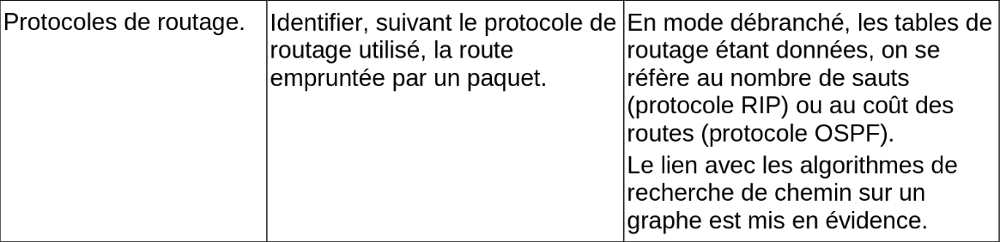
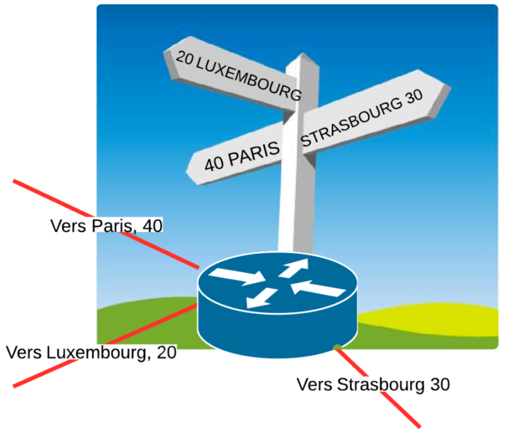
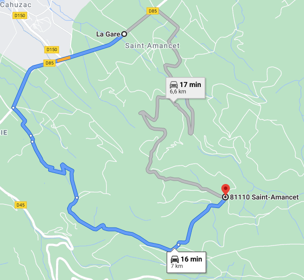
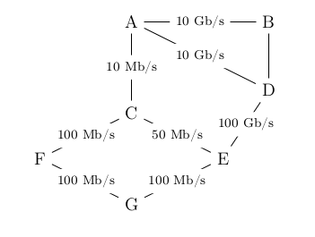

# CH8 : Routage

??? note "Programme officiel"
    {: .center}

## Rappels de première sur les réseaux
### Cours
[](http://www.lumni.fr/video/l-architecture-des-reseaux-et-les-protocoles-de-communications "Cours réseaux 1ère")


!!! savoir "Notations à connaître par coeur"

    - Une adresse IPv4 estcomposée de 4 octets, soit 32 bits. Elle est notée a.b.c.d, où a, b, c et d sont les valeurs des 4 octets.
    - La notation a.b.c.d/n signifie que les n premiers bits de l'adresse IP représentent la partie « réseau », les bits qui suivent représentent la partie « machine ».
    - L'adresse IPv4 dont tous les bits de la partie « machine » sont à 0 est appelée « adresse du réseau ».
    - L'adresse IPv4 dont tous les bits de la partie « machine » sont à 1 est appelée « adresse de diffusion » ou de « broadcast » :gb:.


### Test rapide

!!! check "question 1"
    === "qcm"
        La communication d'information entre deux machines se fait :

        {{ qcm(["par paquets", "en continu", "en série", "en parallèle"], [1], shuffle = True) }}
    === "éléments de correction"
        La communication entre deux machines se fait par paquets. Revoir cours de première.

!!! check "question 2"
    === "qcm"
        Quelles sont les adresses IP valides ?

        {{ qcm(["192.168.1.16", "10.0.0.1", "192.256.45.2", "10.54.16"], [1, 2], shuffle = True) }}
    === "éléments de correction"
        Les adresses IPv4 sont codées sur 32 bits. Donc sur 4 octets et la valeur d'un octet est comprise entre 0 et 255.

!!! check "question 3"
    === "qcm"
        L'adresse IP en binaire d'une machine est "11000000.10101000.00010000.10011000". Quelle est sa représentation en décimal ?

        
        {{ qcm(["192.168.16.152", "192.168.8.152", "192.168.16.76", "3.21.8.25"], [1], shuffle = True) }}

    === "éléments de correction"
        Revoir les conversions binaire/décimal.

!!! check "question 4"
    === "qcm"
        L'adresse IP d'une machine est 192.168.1.16/24. Quelle est l'adresse du réseau ?

        {{ qcm(["192.168.1.0", "0.0.0.16", "192.168.1.24", "192.168.0.0"], [1], shuffle = True) }}
    === "éléments de correction"
        192.168.1.16/24 donc les 24 premiers bits ou les trois premiers octets représentent la partie réseau. Pour avoir l'adresse du réseau on met les bits de la partie machine à 0. Donc le dernier octet vaut 0.

!!! check "question 5"
    === "qcm"
        L'adresse IP d'une machine est 192.168.1.16/24. Quel est le nombre maximal de machines que l'on peut connecter sur le réseau ?

        {{ qcm(["254", "255", "256", "16"], [1], shuffle = True) }}
    === "éléments de correction"
        Les trois premiers octets étant réservés pour le réseau, il reste donc 1 octet (8 bits) pour les adresses machines. Cela nous donne 256 possibilités moins 2 (adresse du réseau à 0 et celle de broadcast à 255) donc 254 machines maximum.

## 1. Routeur et routage
### 1.1 Qu'est ce qu'un routeur ?
!!! savoir "Définition"
    Un **routeur** est un matériel réseau (une sorte d'ordinateur), qui a vocation a relayer / router les paquets d'information reçus en entrée, vers leur prochaine destination (le prochain routeur), voire leur destination finale (lorsqu'ils sont arrivés). Un routeur dispose de (au moins) 2 interfaces réseau :

    - Chaque interface réseau d'un routeur dispose d'une adresse IP distincte
    - Chaque interface réseau d'un routeur définit un réseau différent

Une " box internet " est un routeur. Elle permet de transférer des informations (paquets) entre le réseau local (ordinateurs, smartphones, TV, objets connectés ...) de la maison et le " réseau internet ".


Cette box comprend :

- une interface est connectée au réseau de votre opérateur / Fournisseur d'Accès (FAI)
- une ou plusieurs interfaces filaires (ethernet) connectées à votre réseau local
- une interface Wifi

En fait, une box familiale joue plusieurs rôles:

- Le rôle de routeur pour déterminer les meilleurs routes par lesquelles acheminer/router les paquets de données.
- Le rôle de passerelle / gateway :gb: pour sortir du réseau local.
- le rôle de commutateur / switch :gb: pour permettre la communication entre eux des hôtes d'un même réseau.


### 1.2 Quel est son role ?
Essentiellement, le rôle d'un routeur est de:

#### Relayer / Router les paquets de données

Chaque routeur reçoit des données en entrée, sous forme de paquets, et doit décider à qui les **relayer / rediriger / router** :

- vers le prochain routeur / passerelle / gateway, également surnommé le saut suivant / next hop :gb:. En pratique, de manière équivalente, le routeur doit déterminer vers laquelle de ses propres interfaces de sortie / ports il doit relayer / router / rediriger le paquet. Pour prendre une telle décision, le routeur dispose de **table de routage**.
- vers la machine de destination, si le paquet est arrivé au routeur final, directement connecté réseau de destination.

#### Maintenir à jour ses tables de Routage
Les réseaux sont soumis à des évolutions constantes, prévues ou pas, souhaitées ou pas. Cela oblige la mise à jour/le maintien réguliers des tables de routage dans les routeurs en cas d'ajout de nouveau matériel, de pannes imprévues, ...


### 1.3 Qu'est ce que le routage ?
### 1.4 Tables de routage.
Une **table de routage** est une sorte de "panneau indicateur" qui donne les routes (les réseaux) joignables à partir du "carrefour" que constitue un routeur. Les paquets arrivent sur une interface de la machine. Pour "router" le paquet, le routeur fondera sa décision en deux temps :

- d’abord il regarde dans l’en-tête IP le réseau de destination et compare toutes les entrées dont il dispose dans sa table de routage;
- ensuite, si le réseau de destination est trouvé, il commute le paquet sur le bon port de sortie; si ce réseau n’est pas trouvé, le paquet est jeté.



#### Quels sont les éléments d'une table de routage ?
Le routage IP peut trouvée une analogie avec le système routier ou encore le routage postal.

- Un **réseau de destination et son masque** = une ville
- Une **passerelle** ou **une interface de sortie** = une direction
- Une **distance administrative** ou **métrique** = un kilométrage

#### Exemple :


Les tables de routage sont des informations stockées dans le routeur permettant d'aiguiller intelligemment les données qui lui sont transmises.

Dans le réseau ci-dessus, si l'ordinateur d'adresse ```192.168.0.5``` veut interroger le serveur ```10.7.3.8``` :

- l'adresse ```10.7.3.8``` n'étant pas dans le sous-réseau F (d'adresse ```192.168.0.0 / 24```), la requête est confiée au routeur via son adresse passerelle dans le réseau F (ici ```192.168.0.254```).
- le routeur observe si l'IP recherchée appartient à un autre des sous-réseaux auquel il est connecté. Ici, l'IP recherchée ```10.7.3.8``` n'appartient ni au sous-réseau A ou E. 
- le routeur va donc regarder dans sa table de routage l'adresse passerelle d'un autre routeur vers qui elle doit rediriger les données. Si le sous-réseau C fait partie de sa table de routage, le routeur R1 saura alors que le meilleur chemin est (par exemple) de confier les données au routeur R3.
- si le sous-réseau C ne fait pas partie de la table de routage, le routeur R1 va alors le rediriger vers une route «par défaut» (que l'on peut assimiler au panneau «toutes directions» sur les panneaux de signalisation).

Par exemple, la table de routage du routeur R1 pourrait être :

| Destination | Passerelle | Métrique |
|-|-|-|
| 192.168.0.0 /24 | | 1 |
| 172.17.1.0 /24 | | 1 |
| 10.0.5.0 /24 | | 1 |
| 10.5.2.0 /24 | 172.17.1.147 | 2 |
| 10.7.3.0 /24 | 10.0.5.135 | 2 |

Dans notre exemple la métrique représente de nombre de saut pour atteindre le réseau de destination. Une distance égale à 1 signifie que le réseau de destination est directement connecté (protocole RIP) Ce n'est pas toujours le cas. On se préocupera de cette notion de métrique dans les protocoles de routage.

??? note "Exercice"
    === "Énoncé"
        Construire les tables de routage de R2, R3 et R4. Attention sur le schéma, des routeur n'ont pas d'adresse pour leur interface (passerelle). Il faut donc en allouer une en faisant attention à ce qu'elle ne soit pas déja prise.

    === "Solution"
        Exemple de solutions :

        Pour R2 :

        | Destination | Passerelle | Metrique |
        |-|-|-|
        | 172.17.1.0 /24 | | 1 |
        | 10.5.2.0 /24 | | 1 |
        | 192.168.0.0 /24 | 172.17.1.254 | 2 |        
        | 10.0.5.0 /24 | 172.17.1.254 | 2 |
        | 10.7.3.0 /24 | 10.5.2.254 | 2 |

        Pour R3 :

        | Destination | Passerelle | Metrique |
        |-|-|-|
        | 10.0.5.0 /24 | | 1 |
        | 10.7.3.0 /24 | | 1 |
        | 172.17.1.0 /24 | 10.0.5.152 | 2 |
        | 10.5.2.0 /24 | 10.7.3.132 | 2 |
        | 192.168.0.0 /24 | 10.0.5.152 | 2 |

        Pour R4 :

        | Destination | Passerelle | Metrique |
        |-|-|-|
        | 10.5.2.0 /24 | | 1 |
        | 10.7.3.0 /24 | | 1 |
        | 10.0.5.0 /24 | 10.7.3.254 | 2 |
        | 172.17.1.0 /24 | 10.5.2.138 | 2 |
        | 192.168.0.0 /24 | 10.5.2.138 | 3 |

        Remarque : pour atteindre le réseau 192.168.0.0, on peut passer par la passerelle 10.7.3.254 en 3 sauts également. 

!!! savoir "À retenir"
    Lorsque que l'adresse IP de destination d'un paquet ne fait pas partie du sous réseau auquel la machine émettrice appartient, le routeur interroge sa table de routage pour connaître l'adresse de la passerelle vers qui rediriger le paquet.

    Dans la table de routage on va donc trouver :

    - l'**adresse du réseau destinataire** (avec le masque de sous réseau).
    - l'**adresse de la passerelle**. C'est l'adresse du routeur suivant vers qui on doit acheminer le paquet. Lorsque le réseau de destination est directement accessible on ne note pas l'adresse ou on met `0.0.0.0` (C'est une adresse invalide  qui signifie "toutes directions" ou "destination non spécifiée".). Dans certaines tables simplifiées, on donne directement le nom du routeur suivant (R2, R3 ...).
    - l'**interface** (wifi, ethernet ...). Dans nos exercices et exemples, elle n'est pas toujours renseignée car l'info est non essentielle pour comprendre le mécanisme de routage.
    - la **métrique** ou le **nombre de sauts** (cela va dépendre du protocole utilisé : RIP, OSPF ...)


#### Comment sont construites les tables de routage ?

- Soit à la main par l'administrateur réseau, quand le réseau est petit : on parle alors de table **statique**.
- Soit de manière **dynamique** : les réseaux s'envoient eux-mêmes des informations permettant de mettre à jour leurs tables de routages respectives. Des algorithmes de détermination de meilleur chemin sont alors utilisés : nous allons en découvrir deux, le protocole RIP et le protocole OSPF.

## 2. Protocoles de routage
### 2.1 protocole RIP
Le protocole **RIP - Routing Information Protocol** :gb: est un protocole dit à vecteur de distance. Le protocole RIP est un des premiers algorithmes utilisés pour établir les tables de routage des routeurs interconnectant des réseaux.

Les paquets sont acheminés en s’appuyant sur l’algorithme de Bellman-Ford (pas au BAC). Cet algorithme permet de calculer les plus courts chemins dans un graphe.

#### TP RIP débranché
[sujet](data/TP_RIP.pdf)

#### Établissement des tables de routage
Il comporte les 3 étapes suivantes :

#####  - Étape 1 -
Initialement (à la mise sous tension), la table de routage d’un routeur contient uniquement des informations sur ses voisins directs (ceux auxquels il est connecté).

Exemple :


Initialement (mise sous tension) la table de routage de R1 contient uniquement les réseaux 192.168.1.0 /24 et 10.1.1.0 /30.

Table de routage de R1

| Réseau destination | Passerelle | Interface |  Métrique |
|-|-|-|-|
| 192.168.1.0 /24 | | wlan0 | 1 |
| 10.1.1.0 /30 | | eth1 | 1 |

Aucune passerelle n’est spécifiée car le routeur peut atteindre le réseau destination directement.

##### - Étape 2 -
Chaque routeur envoie périodiquement (toutes les 30 secondes), à tous ses voisins (routeurs adjacents), un message contenant :

- la liste de toutes les adresses de réseaux qu’il connait (ses voisins directs et ceux qu’il a reçu auparavant)
- leur métrique (le nombre de sauts pour les atteindre).

Ce couple d’informations (réseau, métrique) est appelé *vecteur de distance*.

##### - Étape 3 -
À chaque réception d’un message de ce type, un routeur met à jour sa table de routage avec les informations reçues. Quatre cas peuvent se présenter :

    1. il découvre une nouvelle route vers un sous réseau qu’il ne connaissait pas encore : il l’ajoute à sa table.
    2. il découvre une nouvelle route plus courte vers un sous réseau qu’il connaissait déjà : il remplace l’ancienne route par la nouvelle.
    3. il reçoit une nouvelle route plus longue vers un sous réseau qu’il connaissait déjà : il ne fait rien.
    4. il reçoit une route existante dans sa table (passant par le même voisin), mais plus longue. Cela signifie que la route s’est allongée (panne ?) : il met sa table à jour.

Pour renseigner la colonne « métrique », le protocole utilise le nombre de sauts, autrement dit, le nombre de routeurs qui doivent être traversés pour atteindre le réseau cible.

Exemple :

le routeur R1 reçoit des messages de la part de son seul voisin R3. Ce message contient les vecteurs de distance suivants :

- (10.1.2.0 /30 , 1)
- (10.1.3.0 /30 , 1)
- (10.1.4.0 /30 , 1)
- et tous les vecteurs de distance concernant les autres réseaux qu’il « connait ».

Du point de vue de R1, R3 (d’adresse 10.1.1.2 /30) est une passerelle.

Sa table de routage devient alors :

Table de routage de R1

| Réseau destination | Passerelle | Interface | Métrique |
|-|-|-|-|
| 192.168.1.0 /24 | | wlan0 | 1 |
| 10.1.1.0 /30 | | eth1 | 1 |
| 10.1.2.0 /30 | 10.1.1.2 /30 | eth1 | 2 |
| 10.1.3.0 /30 | 10.1.1.2 /30 | eth1 | 2 |
| 10.1.4.0 /30 | 10.1.1.2 /30 | eth1 | 2 |

##### Délai de convergence

On appelle délai de convergence le temps nécessaire à ce que l’ensemble des routeurs soient configurés pour offrir les meilleurs routes possible. À chaque modification du réseau (ajout ou suppression de routeurs), il faut un certain temps pour que les échanges de messages RIP mènent à une situation stable.

C’est pour limiter ce délai de convergence que le protocole RIP est limité à 15 sauts.

##### Détection des pannes

Lorsqu’un routeur ne reçoit pas de réponse de la part d’un autre routeur à une demande RIP (après un certain laps de temps, 3 minutes), il considère que le routeur en question est en panne.

Afin qu’aucun paquet ne soit plus dirigé dans cette direction, il prévient ses voisins en leur envoyant une **métrique égale à 16** (plus grande valeur possible pour le protocole RIP) concernant toutes les routes passant par le routeur qui ne répond pas.

##### Boucle de routage

Une boucle de routage est le phénomène qui se produit lorsqu’un paquet tourne en boucle et ne peut jamais atteindre sa destination.

Différentes règles dans le protocole RIP permettent d’éviter que cela se produise, et notamment la règle split horizon, qui interdit à un routeur d’envoyer une information de routage via le routeur qui lui a envoyé.

Le protocole RIP est aujourd’hui très rarement utilisé dans les grandes infrastructures car il génère, du fait de l’envoi périodique de messages, un trafic réseau important (surtout si les tables de routages contiennent beaucoup d’entrées). De plus, le protocole RIP est limité à 15 sauts (on traverse au maximum 15 routeurs pour atteindre sa destination). On lui préfère donc souvent le protocole OSPF.


!!! note "Remarques concernant la métrique"
    Au sens du protocole RIP, La **métrique** ou **distance** d'un routeur à un réseau de destination est le **nombre de sauts** (de routeurs) ou **hops** :gb: qui le séparent de ce réseau, càd le nombre de routeurs devant être traversés/sautés pour parvenir au réseau.
    Dans le protocole RIP, la distance est un nombre entier compris entre 1 et 15 inclus.
    
    - Une distance égale à 1 signifie que le réseau de destination est directement connecté.
    - Une distance égale à 16 représente l'infini, donc que le réseau de destination n'est pas atteignable.

!!! note "Remarques et inconvénients"

    - Le protocole RIP n'admet qu'une distance maximale égale à 15 (ceci explique que 16 soit considéré comme la distance infinie), ce qui le limite aux réseaux de petite taille.
    - Chaque routeur n'a jamais connaissance de la topologie du réseau tout entier : il ne le connaît que par ce que les autres routeurs lui ont raconté. On dit que ce protocole de routage est du routing by rumor.
    - La métrique utilisée (le nombre de sauts) ne tient pas compte de la qualité de la liaison, contrairement au protocole OSPF.


### 2.2 protocole OSPF
Le protocole OSPF : *Open Shortest Path First* :gb: rentre dans la catégorie plus générale des protocoles à États de Lien.

Explication : Un inconvénient majeur du protocole précédent est la non-prise en compte de la bande passante reliant les routeurs.

!!! abstract "principe fondamental du protocole OSPF :heart:"
    Le chemin le plus rapide n'est pas forcément le plus court.

{: .center width=40%}

<div>
<center>
<i>
En gris, le chemin RIP. En bleu, l'OSPF.
</i>
</center>
</div>


Donc dans le protocole OSPF, les tables de routage vont prendre en considération la vitesse de communication entre les routeurs.

Dans une première phase d'initialisation, chaque routeur va acquérir (par succession de messages envoyés et reçus) la connaissance **totale** du réseau (différence fondamentale avec RIP) et de la qualité technique de la liaison entre chaque routeur.

#### Les différents types de liaison et leur coût
On peut, approximativement, classer les types de liaison suivant ce tableau de débits **théoriques** :


| Technologie | BP descendante | BP montante |
|-|-|-|
| Modem | 56 kbit/s | 48 kbit/s |
| Bluetooth | 3 Mbit/s | 3 Mbit/s |
| Ethernet | 10 Mbit/s | 10 Mbit/s |
| Wi-Fi |  10 Mbit/s ~ 10 Gbits/s | 10 Mbit/s ~ 10 Gbits/s |
| ADSL | 13 Mbit/s | 1 Mbit/s |
| 4G | 100 Mbit/s | 50 Mbit/s |
| Satellite | 50 Mbit/s | 1 Mbit/s |
| Fast Ethernet | 100 Mbit/s | 100 Mbit/s |
| FFTH (fibre) | 10 Gbit/s | 10 Gbit/s |
| 5G | 20 Gbit/s | 10 Gbit/s |


L'idée du protocole OSPF est de pondérer chaque trajet entre routeurs (comptant simplement pour «1» dans le protocole RIP) par une valeur de **coût** inversement proportionnelle au débit de transfert.

Par exemple, si le débit $d$ est exprimé en bits/s, on peut calculer le coût de chaque liaison par la formule :

$$ \text{coût} = \frac{10^8}{d} $$


Cette formule de calcul peut être différente suivant les exercices, et sera systématiquement redonnée. Néanmoins la valeur $d$ sera toujours au dénominateur, pour assurer la proportionnalité inverse du débit.


Avec cette convention, un route entre deux routeurs reliés en Fast Ethernet (100 Mbits/s) aura a un poids de 1, une liaison satellite de 20 Mbits/s aura un poids de 5, etc.

#### Exemple

Reprenons le réseau suivant :

{: .center  width=60%}


et simplifions-le en ne gardant que les liens entre routeurs, en indiquant leur débit :


{: .center width=60%}


Notre réseau est devenu un **graphe**. 

Nous allons pondérer ses arêtes avec la fonction coût introduite précédemment. L'unité étant le Mbit/s, l'arête entre R1 et R3 aura un poids de $\frac{100}{20}=5$.

Le graphe pondéré est donc :


{: .center width=60%}


Le chemin le plus rapide pour aller de l'ordinateur au serveur est donc R1-R2-R4, et non plus R1-R3 comme l'aurait indiqué le protocole RIP.

### Trouver le plus court chemin dans un graphe pondéré
L'exemple précédent était très simple et de solution intuitive. Dans le cas d'un graphe pondéré complexe, existe-t-il un algorithme de détermination du plus court chemin d'un point à un autre ?

La réponse est **oui**, depuis la découverte en 1959 par Edsger Dijkstra de l'algorithme qui porte son nom, **l'algorithme de Dijkstra**.

Pour le comprendre, vous pouvez regarder la vidéo d'un célèbre YouTuber :

<p align="center">
<iframe width="790" height="372" src="https://www.youtube.com/embed/rI-Rc7eF4iw" title="YouTube video player" frameborder="0" allow="accelerometer; autoplay; clipboard-write; encrypted-media; gyroscope; picture-in-picture" allowfullscreen></iframe>
</p>

Cet algorithme, ici exécuté de manière manuelle, est bien sûr programmable. Et c'est donc grâce à lui que chaque routeur calcule la route la plus rapide pour acheminer les données qu'il reçoit.

!!! abstract "Exercice d'application de l'algorithme de Dijkstra (HP)"
    
    Donner le plus court chemin pour aller de E à F dans le graphe ci-dessous :
    {: .center width=60%}

    ??? tip "correction"
        |E|A|B|C|D|F|Choix|
        |:-:|:-:|:-:|:-:|:-:|:-:|:-:|
        |**0**|--|--|--|--|--|E(0)|
        |.|30vE|--|40vE|**10vE**|--|D(10)|       
        |.|**20vD**|--|40vE|.|80vD|A(20)|
        |.|.|60vA|**30vA**|.|80vD|C(30)|
        |.|.|**50vC**|.|.|80vD|B(50)|
        |.|.|.|.|.|**70vB**|F(70)|

        Le meilleur trajet est donc E-D-A-C-B-F.  
        Attention ce trajet correspond à la colonne choix (dans l'ordre) mais c'est un hasard.


## 3. Exercices

### extrait du sujet 0 - BAC

On considère le réseau suivant :

{: .center width=40%}


On rappelle que le coût d’une liaison est donné par la formule suivante :


$$ \text{coût} = \frac{10^8}{d} $$


**Question 1**

1. Vérifier que le coût de la liaison entre les routeurs A et B est 0,01.
2. La liaison entre le routeur B et D a un coût de 5. Quel est le débit de cette liaison ?


**Question 2**

Le routeur A doit transmettre un message au routeur G, en empruntant le chemin dont la somme des coûts sera la plus petite possible. Déterminer le chemin parcouru. On indiquera le raisonnement utilisé.

??? tip "Correction"
    **Q1**  
    1. $\text{coût} = \dfrac{10^8}{10 \times 10^9}= \dfrac{10^8}{10^{10}}= 10^{-2}=0,01$  
    2. $5=\dfrac{10^8}{d}$ donc $d=\dfrac{10^8}{5}=20 \times 10^6$ = 20 Mb/s
    

    **Q2**
    Le graphe pondéré par les coûts est :
    {: .center}

    On peut y deviner le chemin de coût minimal entre A et G, qui est A-D-E-G (coût 1,011).  
    Pour le justifier, on peut (non obligatoire) faire un algorithme de Dijkstra :
    {: .center}


### 2021, sujet Métropole 1

On représente ci-dessous un réseau dans lequel R1, R2, R3, R4, R5 et R6 sont des routeurs. Le réseau local L1 est relié au routeur R1 et le réseau local L2 au routeur R6.
```

{: .center width=70%}


Dans cet exercice, les adresses IP sont composées de 4 octets, soit 32 bits. Elles sont notées X1.X2.X3.X4, où X1, X2, X3 et X4 sont les valeurs des 4 octets, convertis en notation décimale.
La notation X1.X2.X3.X4/n signifie que les n premiers bits de poids forts de l’adresse IP représentent la partie « réseau », les bits suivants représentent la partie « hôte ».
Toutes les adresses des hôtes connectés à un réseau local ont la même partie réseau et peuvent donc communiquer directement. L’adresse IP dont tous les bits de la partie « hôte » sont à 0 est appelée « adresse du réseau ».

On donne également des extraits de la table de routage des routeurs R1 à R5 dans le tableau suivant :

{: .center width=70%}

**Question 1**

Un paquet part du réseau local L1 à destination du réseau local L2.

1.a. En utilisant l’extrait de la table de routage de R1, vers quel routeur R1 envoie-t-il ce paquet : R2 ou R3 ? Justifier.

1.b. A l’aide des extraits de tables de routage ci-dessus, nommer les routeurs traversés par ce paquet, lorsqu’il va du réseau L1 au réseau L2.

**Question 2**

La liaison entre R1 et R2 est rompue.

2.a. Sachant que ce réseau utilise le protocole RIP (distance en nombre de sauts), donner l’un des deux chemins possibles que pourra suivre un paquet allant de L1 vers L2.

2.b. Dans les extraits de tables de routage ci-dessus, pour le chemin de la question 2.a, quelle(s) ligne(s) sera (seront) modifiée(s) ?

**Question 3**

On a rétabli la liaison entre R1 et R2.
Par ailleurs, pour tenir compte du débit des liaisons, on décide d’utiliser le
protocole OSPF (distance liée au coût minimal des liaisons) pour effectuer le
routage. Le coût des liaisons entre les routeurs est donné par le tableau suivant :

{: .center width=90%}

3.a. Le coût _C_ d’une liaison est donné ici par la formule
$C = \dfrac{10^9}{BP}$

où $BP$ est la bande passante de la connexion en bps (bits par seconde).
Sachant que la bande passante de la liaison R2-R3 est de 10 Mbps, calculer le coût correspondant.

3.b. Déterminer le chemin parcouru par un paquet partant du réseau L1 et arrivant au réseau L2, en utilisant le protocole OSPF.

3.c. Indiquer pour quel(s) routeur(s) l’extrait de la table de routage sera modifié pour un paquet à destination de L2, avec la métrique OSPF.

??? tip "Correction"
    1.a. D'après la table, R1 doit passer par la passerelle 86.154.10.1 qui correspond au routeur R2.  
    1.b. Le paquet va traverser R1, R2, R6 avant d'arriver à L2.  
    2.a. RIP doit minimiser le nombre de sauts, donc les deux chemins minimaux possibles sont R1-R3-R4-R6 et R1-R3-R2-R6.  
    2.b. La ligne R1 sera modifiée, il faudra partir vers R3 (et son réseau 112.44.65.0/24). Les autres lignes n'ont pas à être modifiées puisque R3 amène en R4 qui amène en R6.  
    3.a $\dfrac{10^9}{10 \times 10^6}=100$ donc le coût R2-R3 est 100.  
    3.b. Avec OSPF, le chemin qui minimise le coût est le chemin R1-R2-R4-R5-R6 (coût 103) :
    {: .center width=50%}
    3.c. Dans la table de routage initiale, il faut modifier R2 pour qu'elle envoie sur R4 (et non sur R6), mais aussi R4 pour qu'elle envoie sur R5 (et non sur R6).

  

??? note "Sites utilisés et sources"
    - [https://glassus.github.io/terminale_nsi/T5_Architecture_materielle/5.3_Protocoles_de_routage/cours/](https://glassus.github.io/terminale_nsi/T5_Architecture_materielle/5.3_Protocoles_de_routage/cours/)
    - [https://eskool.gitlab.io/tnsi/reseaux/](https://eskool.gitlab.io/tnsi/reseaux/)
    - [https://info.blaisepascal.fr/nsi-protocoles-de-routage](https://info.blaisepascal.fr/nsi-protocoles-de-routage#Topologie_dun_reseau)
    - [https://cisco.goffinet.org/ccna/](https://cisco.goffinet.org/ccna/)
    - Numérique et Sciences Informatiques, Terminale, T. BALABONSKI, S. CONCHON, J.-C. FILLIATRE, K. NGUYEN, éditions ELLIPSES.
    - Prépabac NSI, Terminale, G. CONNAN, V. PETROV, G. ROZSAVOLGYI, L. SIGNAC, éditions HATIER.