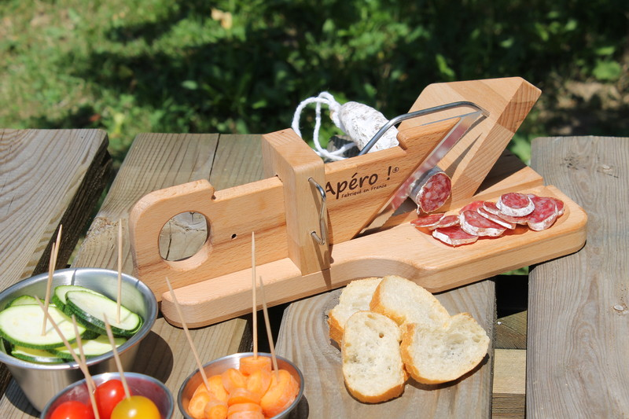

# CH3 : Structures de données

??? note "Programme officiel"
    {: .center}

Le langage Python dispose, comme tous les langages de haut niveau, d'un ensemble de types simples et de types structurés vus dans le programme de première : nombres, booléens, chaînes de caractères, tuples, tableaux, dictionnaires ...
Ces types de bases sont appellés **types concrets**. Cette année, comme nous allons manipuler des données plus complexes que des simples nombres, on va créer des structures de données plus complexes. Pour définir ces structures, on utilise des **types abstraits de données**.

## 1. Type abstrait de données

### 1.1 Interface
Un **type abstrait** est caractérisé par une **interface de programmation**. L'interface, c'est l'ensemble des opérations qui vont permettre de manipuler les données.

On distingue :
- les **constructeurs** qui permettent de créer une nouvelle structure de données.
- les **opérateurs** qui permettent de modifier la structure. On peut par exemple ajouter ou retirer des données.
- les **accesseurs** qui donnent des informations sur la structure. Par exemple, donner le nombre d'éléments dans la structure.
- les **itérateurs** qui permettent d'énumérer les éléments de la structure.

### 1.2 Implémentation
**Implémenter** un type abstrait, c'est coder les différentes opérations qui répondent à spécification de l'interface. Il est possible de réaliser plusieurs implémentations différentes pour répondre à la même spécification. Certaines implémentation vont être plus rapides,  moins gourmandes en espace mémoire, plus adaptées à la taille des données ...


!!! exp "Du concret pour mieux comprendre : INTERFACE vs IMPLÉMENTATION"
    On peut choisir comme image une machine à café à capsule, dans laquelle on peut distinguer :
    
    <center>**L'interface**</center>
    {: .center width=50%}

    On distinge ici : les boutons, le levier, les petites lumières ... C'est la partie **utilisateur**.

    <center>**L'implémentation**</center>
    {: .center width=50%}

    Sur ce schéma apparaissent : les électrovannes, la pompe, le bloc de chauffe, voire le déroulement des opérations ... C'est la partie **constructeur**.

    Pas besoin de savoir comment fonctionne la machine à l'intérieur (implémentation), pour se faire un café (interface)...
   
Dans notre programme de terminale, on va présenter plusieurs types abstraits comme : les listes (Ne pas confondre avec le type `list` de Python), les piles, les files ... On va apprendre à utiliser ces types, puis on les implémentera de différentes façon.

### 1.3 Exemple des tableaux
En première, on utilise des objets de type `list` pour manipuler des données. Le type `list` est un type concret du langage Python. Par abus de langage on appelle cela des **listes** mais en fait ce sont des **tableaux dynamiques**. L'interface de ce type serait :


| Opérations  | Exemple(s)             |complexité|
|-------------|------------------------|----------|
|Constructeurs|`l = []` ou `l = list()`| O(1)     |
|accesseurs   | `len(l)`               | O(1)     |
|             | `l[i]`                 | O(1)     |
|opérateurs   | `l[i] = x`             | O(1)     |
|             | `l.append(x)`          | O(1)     |
|             | `l.insert(i, x)`       | O(n)     |
|             | `l.pop()`              | O(1)     |
|             | `del l[i]`             | O(n)     |
|itérateurs   | `for elt in l`         | O(n)     |


??? question "Exercice 1"
    === "Énoncé"
        Donner le contenu de la variable `l` après avoir executer les instructions ci-dessous :
        ```python
        >>> l = list()
        >>> l.append(4)
        >>> l.append(6)
        >>> l.insert(0, 6)
        >>> l.pop()
        >>> l[0] = 2
        >>> l.append(3)
        ```
    === "Solution"
        ```python
        [2, 4, 3]
        ```
        Là encore pas besoin de comprendre comment cela fonction. Il suffit juste d'utiliser l'interface.

### 1.4 Exemples de types abstraits
Voici les différents types abstraits que l'on va étudier cette année.
{: .center}


## 2. Les listes

## 3. Les piles

## 4. Les files


## 5. Les dictionnaires
### 5.1 tableau associatif
Les dictionnaires ont déjà été étudiés en classe de première. Pour rappel, ce type de données,
aussi appelé **tableau associatif** , permet de stocker des **valeurs** et d'y accéder au moyen d'une **clé** ,
contrairement au tableau qui permet d'accéder à une donnée au moyen d'un indice .

On parle d'association **clé: valeur**. Le langage Python fournit directement le type structuré `dict` qui implémente un dictionnaire.

- **Constructeur** : ```d = dict()``` ou ```d = {}``` , création d'un dictionnaire nommé `d`.
- **opérateur** : ```d[cle] = valeur``` , ajouter une association `cle: valeur` dans `d`.
- **accesseur** : ```d[cle]``` , lire la `valeur` associée à `cle` dans `d`.
- **itérateur** : ```for cle in d``` , énumèrer toutes les clés de `d`.

!!! exemple "Exemple"
    ```python
    >>> dico = dict()
    >>> dico["nom"] = "Jannel"
    >>> dico["prenom"] = "David"
    >>> print(f:"{dico["nom"]} {dico["prenom"]}")
    Jannel David
    ```

La recherche dans un dictionnaire est optimisée pour s'effectuer sur les clés et non sur les
valeurs. Par exemple avec le dictionnaire que nous avons créé précédemment dans l'exemple, la commande
```"Nom" in dico``` renverra `True` alors que ```"Jannel" in dico``` renverra `False` . Dans un dictionnaire, 
les clés et les valeurs ne jouent donc pas du tout le même rôle et ne sont pas interchangeables.

### 5.2 Tables de hachage et clés
Une clé peut être d'un autre type que chaîne de caractère, du moment que c'est un objet
non mutable , c'est à dire qui ne peut pas être modifié. Une clé ne peut pas être une liste
par exemple car une liste est un objet mutable que l'on peut modifier, par exemple au travers
de la méthode .append().

Regardons ce qui se passe si on essaye de définir une clé de type list pour un dictionnaire :
```python
>>> dico[[2, 1]] = "blablabla ..."
Traceback (most recent call last):
File "<stdin>", line 1, in <module>
TypeError: unhashable type: 'list'
```
Le type `list` n'est pas pas **hashable** . Mais qu'est-ce que le hachage ?


[{ width=50% ; align=center}](https://youtu.be/IhJo8sXLfVw)

### 5.3 Implémentation d'un type *dictionnaire* à l'aide d'une table de hachage
#### Présentation du problème
Ici on ne veut pas utiliser directement le type `dict` de Python. Une implémentation simple consiste à créer une liste de tuples `(cle, valeur)`.

Le problème de cette implémentation est dans l'efficacité de la recherche d'une clé. On doit parcourir la totalité de la liste au pire des cas et donc la compléxité est linéaire O(n).

Une implémentation plus efficace est donc de continuer à utiliser un tableau et à transformer la clé en un indice à l'aide d'une fonction de hachage. Ça a l'avantage de trouver directement une clé dans le tableau. La fonction de hachage transforme la clé en un indice et il suffit donc de lire la donnée stockée dans le tableau à l'indice correspondant. La complexité de la recherche est donc O(1).

Les différentes étapes de l'implémentation de l'interface sont à réaliser en complétant le fichier [table_hachage_cours.py](table_hachage_cours.py).

#### La fonction de hachage
Si on prend pour clé une chaine de caractère, une fonction de hachage peut consister à additionner le code ascii de chaque caractère, modulo la taille du tableau.
```python
HTAILLE = 109 # taille de la table de hachage
def hachage(cle):
    code = 0
    for car in cle:
        code = code + ord(car)
    return code % HTAILLE
```
!!! question "Question"
    === "Énoncé"
        Quel soucis peut appaître avec une telle fonction de hachage ?
    === "Réponse"
        Il est possible que deux clés différentes aient le même code de hachage. On appelle cela une **collision**.

        Une méthode pour traiter ces collisions, consiste à stocker dans chaque élément de la table de hachage, une liste des tuples `(cle, valeur)`
        qui on le même code de hachage. C'est cette implémentation qui vous est proposée ci-dessous.

#### Le constructeur : Création du dictionnaire
!!! question "Exercice"
    === "Énoncé"
        Créer une fonction `creer_dico` qui ne prend pas d'argument et qui renvoie un tableau contenant `HTAILLE` cases remplies avec `None`.
    === "Réponse"
        ```python
        def creer_dico():
            return [None] * HTAILLE
        ```

#### Un opérateur : Ajouter une entrée dans le dictionnaire
!!! question "Exercice"
    === "Énoncé"
        Créer une fonction `ajouter` qui prend en arguments `dico`, `cle` et `valeur` et qui ajoute le couple `(cle, valeur)` dans le dictionnaire `dico`.
    === "Aides"
        Utiliser les opérations spécifiées dans l'interface des listes données en cours. L'interface et ses opérations doivent être importées dans votre fichier.

        Les entrées de la table de hachage étant des listes, il faut penser à créer une nouvelle liste si elle n'existe pas avant d'ajouter le tuple au dictionnaire.
    === "Solution"
        ```python
        def ajouter_cle(dico, cle, valeur):
            h = hachage(cle)
            if dico[h] == None:
                dico[h] = creer_liste()
            dico[h] = inserer((cle, valeur), dico[h])
            return dico
        ```

#### Un accesseur : lire la valeur associée à un clé du dictionnaire
!!! question "Exercice"
    === "Énoncé"
        Créer une fonction `valeur_cle` qui prend en arguments `dico` et `cle`. Et qui retourne la valeur associée à la clé dans le dictionnaire `dico`.
    === "Aides"
        Vérifier que le résultat de la fonction de hachage, appliquée à la clé, correspond à une liste sinon retourner `None`.

        La fonction `elements_liste` permet de récupérer une liste de tous les tuples présents dans une liste.

    === "Solution"
        ```python
        def valeur_cle(dico, cle):
            h = hachage(cle)
            if dico[h] == None:
                return None
            else:
                for (c, v) in elements_liste(dico[h]):
                    if c == cle:
                    return v
            return None
        ```

#### Un itérateur : lister les clés présentes dans un dictionnaire

#### Étendre l'interface :
L'objectif est d'ajouter une fonction permettant de connaitre le nombre d'éléments (couples) présents dans le dictionnaire.

#### Utiliser l'interface :
Créer une fonction moyenne qui retourne la moyenne des notes présentes dans un dictionnaire ou les clés seraient des noms d'élèves et la valeur associée la note. 