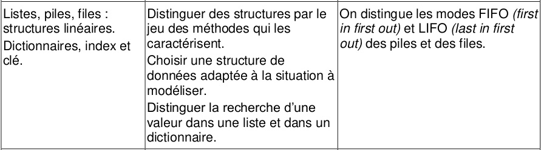
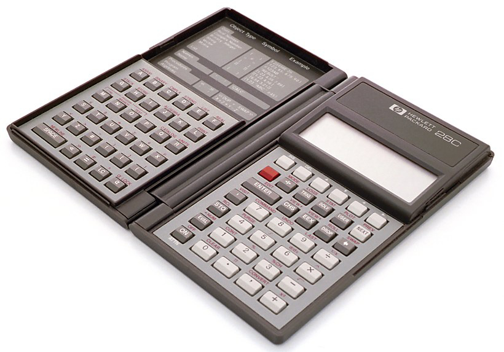

# CH4 : Piles et files

??? note "Programme officiel"
    {: .center}


## 1. Les piles
### 1.1 Qu'est ce qu'une pile ?
{: .center width=50%}

Une structure de **pile** (penser à une pile d'assiette) est associée à la méthode **LIFO** (Last In, First Out) :
les éléments sont empilés les uns au-dessus des autres, et on ne peut toujours dépiler que l'élément du haut de la pile. Le dernier élément à être arrivé est donc le premier à être sorti.

Son interface minimale est :

- **creer_pile()** : constructeur qui retourne une pile vide.
- **pile_vide(p)** : accesseur qui retourne Vrai si la pile p est vide.
- **empiler(e, p)** : opérateur qui ajoute l'élément e au sommet de la pile p.
- **depiler(p)** : opérateur qui retire et retourne le sommet de la pile p (si elle n'est pas vide).
- **sommet(p)** : accesseur qui retourne le sommet de la pile p (si elle n'est pas vide).
- **elements_pile(p)** : itérateur qui énumère les éléments contenus dans la pile p.

{: .center}

!!! example "Exercice : Utilisation de l'interface"
    === "Énoncé"
        On considère l'enchaînement d'opérations ci-dessous. Écrire à chaque étape l'état de la pile ```p``` et la valeur éventuellement renvoyée.
        ```python
        1. p = creer_pile() 
        2. p = empiler(3, p)   
        3. p = empiler(5, p)  
        4. pile_vide(p)  
        4. p = empiler(1, p)  
        5. depiler(p)  
        6. depiler(p) 
        7. p = empiler(9, p)  
        8. depiler(p)  
        9. depiler(p) 
        10. pile_vide(p) 
        ```
    === "Correction"
        ```python
        1. p = None # à ce stade on a aucune connaissance de l'implémentation utilisée 
        2. p = 3   
        3. p = 3, 5  
        4. Faux  
        4. p = 3, 5, 1  
        5. p = 3, 5 et on renvoie 1 
        6. p = 3 et on renvoie 5
        7. p = 3, 9  
        8. p = 3 et on renvoie 9 
        9. p = None et on renvoie 3
        10. Vrai 
        ```


### 1.2 Exemples d'utilisation de piles en informatique
- lors de l'exécution d'une fonction récursive, le processeur empile successivement les appels à traiter : seule l'instruction du haut de la pile peut être traitée.

{: .center}

- dans un navigateur internet, la liste des pages parcourues est stockée sous forme de pile : la fonction «Back» permet de «dépiler» peu à peu les pages précédemment parcourues : 

{: .center}

### 1.3 Exemple d'implémentation
Une implémentation possible consiste à utiliser les tableaux dynamiques (type `list` de Python). Pour réaliser notre implémentation, on utilisera les méthodes `append`, `pop` ...

Les différentes étapes de l'implémentation de l'interface sont à réaliser en complétant le fichier [piles_cours.py](data/piles_cours.py).

#### Le constructeur : création de la pile
!!! question "Exercice"
    === "Énoncé"
        Créer une fonction `creer_pile` qui ne prend pas d'argument et qui renvoie un tableau vide (type `list`).
    === "Solution"
        ```python
        def creer_pile():
            return []
        ```

#### Un accesseur : savoir si la pile est vide
!!! question "Exercice"
    === "Énoncé"
        Créer une fonction `pile_vide` qui prend en argument une pile et qui renvoie `True` si la pile est vide.
    === "Solution"
        ```python
        def pile_vide(pile):
            return pile == []
        ```

#### Un opérateur : ajout d'un élément au sommet de la pile
!!! question "Exercice"
    === "Énoncé"
        Créer une fonction `empiler` qui prend en argument un élément et une liste et place cet élément au sommet de la pile.
    === "Aides"
        La fonction ne renvoie rien. C'est une procédure.
    === "Solution"
        ```python
        def empiler(elt, pile):
            pile.append(elt)
        ```

#### Un opérateur : retirer un élément du sommet de la pile
!!! question "Exercice"
    === "Énoncé"
        Créer une fonction `depiler` qui prend en argument une pile, retire et retourne le sommet de la pile p (si elle n'est pas vide).
    === "Aides"
        Vérifier que la pile passée en argument n'est pas vide avec un `assert`.
    === "Solution"
        ```python
        def depiler(pile):
            assert not pile_vide(pile), "pile vide"
            sommet = pile.pop()
            return sommet
        ```

#### Un accesseur : Connaître le sommet de la pile
!!! question "Exercice"
    === "Énoncé"
        Créer une fonction `sommet` qui prend en argument une pile et renvoie simplement l'élément situé au sommet de la pile (si elle n'est pas vide).
    === "Aides"
        - Vérifier que la pile passée en argument n'est pas vide avec un `assert`.
        - La pile ne doit pas être modifiée.
    === "Solution"
        ```python
        def sommet(pile):
            assert not pile_vide(pile), "pile vide"
            return pile[-1]
        ```

#### Un itérateur : lister les éléments présents dans la pile
!!! question "Exercice"
    === "Énoncé"
        Créer une fonction `elements_pile` qui prend en argument une pile et qui renvoie un tableau contenant les éléments de la pile. Attention, le tableau doit contenir les éléments parcourus du sommet à la base de la pile.
    === "Aides"
        Vous pouvez regarder la documentation de la fonction `range` (`help(range)`).
    === "Solution"
        ```python
        def elements_pile(pile):
            tab_elt = []
            for i in range(len(pile)-1, -1, -1):
                tab_elt.append(pile[i])
            return tab_elt
        ```

#### Étendre l'interface
On peut ajouter un accesseur `taille` qui retourne le nombre d'éléments de la pile.
!!! question "Exercice"
    === "Énoncé"
        Créer une fonction `taille` qui prend en argument une pile et qui renvoie le nombre d'éléments de la pile.
    === "Solution"
        ```python
        def taille(pile):
            return len(pile)
        ```

### 1.4 TD - Implémentation utilisant la POO et utilisation des piles
Travail à réaliser sur le notebook TD_piles.ypnb

Il vous est conseillé de faire et conserver un fichier (module) nommé piles.py avec l'implémentation utilisant la POO.

### 1.5 TP - Réalisation d'une calculatrice
Dans les années 90, les calculatrices HP étaient très réputées dans le milieu scientifique pour la richesse de leures fonctionnalités. Elles possédaient une autre particularité : elles utilisaient la notation dite "polonaise inversée" **NPI** pour effectuer les calculs. Cela signifie que l'on entrait d'abord les éléments pour faire le calcul puis ensuite l'opérateur. Par exemple, pour effectuer l'opération 4 + 3 on entrait successivement 4 puis 3 et enfin +.



On peut donner encore d'autres exemples : pour calculer `(2+3)*11` , on entrera la chaine de caractère "`2 3 + 11 *`". On aurait d'ailleurs le même résultat avec la chaine de caractère "`11 2 3 + *`" qui représenterait `11*(2+3)`.

L'algorithme pour calculer le résultat d'un calcul en notation polonaise inversé utilise une pile. On procéde de la façon suivante. Pour chaque élément de l'expression :

- si c'est un nombre on le place dans la pile.
- si c'est un opérateur, on récupère les deux nombres au sommet de la pile et on leur applique l'opérateur (le premier sommet est à droite de l'opérateur, ce qui est important pour les soustractions et les divisions).

Vous allez réaliser une calculatrice NPI à partir de la classe de pile que nous avons fait précedemment.

!!! question "Travail à faire"
    === "Consignes"
        - Pour faire une calculatrice NPI, vous compléterez la fonction `calcule`qui prend en entrée une chaine de caractère notée `expression` qui est une expression en notation polonaise inversée, et qui renvoi en sortie la valeur du résultat. Si la chaine est bien formée, la pile ne contient plus qu'un seul élément qui est le résultat. Si la chaine est mal formée, la fonction doit renvoyer `None`.

        - Pour faciliter votre travail, la chaine est séparée en élements dans un tableau grâce à split, et il n'y a plus qu'à boucler sur le tableau.

        - Des assertions ont été fournies pour vous aider à vérifier votre travail.

    === "Code à compléter"
        ```python linenums='1'
        class cellule:
            """ Classe qui modélise une cellule dans une structure linéaire """
            def __init__(self,element):
                self.contenu = element
                self.suivant = None

        class pile:
            """ Classe qui implémente une pile"""
            def __init__(self):
                self.sommet = None

            def estVide(self):
                return self.sommet == None

            def empile(self,element):
                nouveau = cellule(element)
                nouveau.suivant = self.sommet
                self.sommet = nouveau

            def depile(self):
                valeur = self.sommet.contenu
                self.sommet = self.sommet.suivant
                return valeur

            def affiche(self):
                pointeur = self.sommet
                while pointeur != None :
                    print(pointeur.contenu)
                    pointeur = pointeur.suivant

        def calcule(expression):
            valeur = None
            tableau = expression.split()
            ### Mettez votre code ici

            return valeur


        assert calcule('2 3 + 11 *') == 55, "erreur sur le premier calcul"
        assert calcule('2 5 * 7  +') == 17, "erreur sur le second calcul"
        assert calcule('8 2 / 4 - ') == 0, "erreur sur le troisième calcul"
        assert calcule('1 2 3 4 + * +') == 15 , "erreur sur le quatrième calcul"
        assert calcule("1 2 3 + ") == None," chaine mal formée mais valeur retournée"
        ```

## 2. Les files
Les différentes étapes de l'implémentation de l'interface sont à réaliser en complétant le fichier [files_cours.py](data/files_cours.py).

### 2.1 Qu'est ce qu'une file ?
{: .center width=40%}

Une structure de **file** (penser à une file d'attente) est associée à la méthode **FIFO** (First In, First Out) :
les éléments sont enfilés les uns à la suite des autres, et on ne peut toujours défiler que l'élément en tête de la file. Le premier élément à être arrivé est donc le premier à en sortir. Sinon ça râle dans la file d'attente.


Son interface minimale est :

- **creer_file** : constructeur qui retourne une file vide.
- **file_vide(f)** : accesseur qui retourne vrai si la file f est vide.
- **enfiler(e, f)** : opérateur qui ajoute l'élément e à la fin de la file f.
- **defiler(f)** : opérateur qui retire l'élément placé en tête de file (si elle n'est pas vide).
- **tete_file(f)** : accesseur qui retourne l'élément placé en tête de la file f (si elle n'est pas vide).
- **elements_file(f)**: itérateur qui énumère les éléments de la file f.

{: .center}


!!! example "Exercice : Utilisation de l'interface"
    === "Énoncé"
        On considère l'enchaînement d'opérations ci-dessous. Écrire à chaque étape l'état de la file ```f``` et la valeur éventuellement renvoyée.
        La convention choisie est : on enfilera **à droite** et on défilera **à gauche**.
        ```python
        1. f = creer_file()
        2. enfiler(3, f) 
        3. enfiler(5, f)
        4. file_vide(f)
        5. enfiler(1, f) 
        6. defiler(f) 
        7. defile(f)
        8. enfiler(9, f) 
        9. defiler(f) 
        10. defiler(f)
        11. file_vide(f) 
        ```
    === "Correction"
        ```python
        1. f =  # dépend de l'implémentation utilisée 
        2. f = 3
        3. f  = 3, 5
        4. faux
        5. f  = 3, 5, 1
        6. valeur renvoyée : 3 , f =  5, 1
        7. valeur renvoyée : 5 , f =  1 
        8. f =  1, 9
        9. valeur renvoyée : 1 , f =  9 
        10. valeur renvoyée : 9 , f =   
        11. vrai
        ```

### 2.2 Exemples d'utilisation de files en informatique 

- **Serveurs d'impression** : `Spoolers` :gb: qui traitent ainsi les requêtes dans l'ordre dans lequel elles arrivent, et les insèrent dans une file d'attente (dite aussi `queue` ou `spool`).
- Certains **moteurs multitâches dans un OS**, qui doivent accorder du temps-machine à chaque tâche, sans en privilégier aucune.

### 2.3 Exemple d'impléméntation
Comme pour les piles, une implémentation possible consiste à utiliser les tableaux dynamiques (type `list` de Python).

Les différentes étapes de l'implémentation de l'interface sont à réaliser en complétant le fichier [files_cours.py](data/files_cours.py).

#### Le constructeur : création de la file
!!! question "Exercice"
    === "Énoncé"
        Créer une fonction `creer_file` qui ne prend pas d'argument et qui renvoie un tableau vide (type `list`).
    === "Solution"
        ```python
        def creer_file():
            return []
        ```

#### Un accesseur : savoir si la file est vide
!!! question "Exercice"
    === "Énoncé"
        Créer une fonction `file_vide` qui prend en argument une file et qui renvoie `True` si la file est vide.
    === "Solution"
        ```python
        def file_vide(file):
            return file == []
        ```

#### Un opérateur : ajout d'un élément en queue de file
!!! question "Exercice"
    === "Énoncé"
        Créer une fonction `enfiler` qui prend en argument un élément et une liste et place cet élément en queue de file.
    === "Aides"
        La fonction ne renvoie rien. C'est une procédure.
    === "Solution"
        ```python
        def enfiler(elt, file):
            file.append(elt)
        ```

#### Un opérateur : retirer un élément de la file
!!! question "Exercice"
    === "Énoncé"
        Créer une fonction `defiler` qui prend en argument une file, retire et retourne la tête de la file f (si elle n'est pas vide).
    === "Aides"
        Vérifier que la file passée en argument n'est pas vide avec un `assert`.
    === "Solution"
        ```python
        def defiler(file):
            assert not file_vide(file), "file vide"
            tete = file.pop(0)
            return tete
        ```

#### Un accesseur : Connaître la tete de la file
!!! question "Exercice"
    === "Énoncé"
        Créer une fonction `tete_file` qui prend en argument une file et renvoie simplement l'élément situé en tête de la file (si elle n'est pas vide).
    === "Aides"
        - Vérifier que la file passée en argument n'est pas vide avec un `assert`.
        - La file ne doit pas être modifiée.
    === "Solution"
        ```python
        def tete_file(file):
            assert not file_vide(file), "file vide"
            return file[0]
        ```

#### Un itérateur : lister les éléments présents dans la file
!!! question "Exercice"
    === "Énoncé"
        Créer une fonction `elements_file` qui prend en argument une file et qui renvoie un tableau contenant les éléments de la file. Attention, le tableau doit contenir les éléments parcourus de la queue à la tête de la file.
    === "Solution"
        ```python
        def elements_file(file):
            return file
        ```

#### Étendre l'interface
On peut ajouter un accesseur `taille` qui retourne le nombre d'éléments de la file.
!!! question "Exercice"
    === "Énoncé"
        Créer une fonction `taille` qui prend en argument une file et qui renvoie le nombre d'éléments de la file.
    === "Solution"
        ```python
        def taille(file):
            return len(file)
        ```

### 2.4 TD - Implémentation utilisant la POO et utilisation des files
Travail à réaliser à partir du [TD_files.pdf](data/TD_files.pdf) en créant un notebook noté : TD_files.ypnb

Il vous est conseillé de faire et conserver un fichier (module) nommé files.py avec l'implémentation utilisant la POO.


