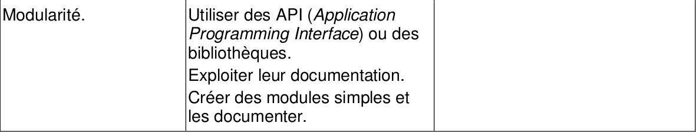

# CH11 : Modularité - API

??? note "Programme officiel"
    {: .center}

## 1. Qu'est qu'une API ?
Une **API** (en anglais « Application programming interface ») est une interface de programmation d’application. Elle est destinée à être utilisée par des programmes. Le principe de ce type d’interface est le même que celui des **UI** (« User Interface ») ou des **GUI** (« Graphical User Interface ») destinées elles à un utilisateur humain.

Composée de constantes, de fonctions, de classes, elle sert de lien entre un programme et les programmes qui vont l’utiliser. Elle peut être proposée par un service web avec une documentation décrivant l’utilisation qui permettra la communication et l’échange des données. Il existe, par exemple, plusieurs API de géolocalisation qui peuvent être intégrées à des programmes. Une API est très souvent proposée par une bibliothèque logicielle composée de fonctions destinées à être utilisées dans divers programmes.

Le principe de base est que le fonctionnement interne n’a pas besoin d’être connu du programme utilisateur. Cela nécessite une documentation fournie décrivant précisément son l’utilisation. Ainsi, lors de l’élaboration d’un logiciel il est possible d’utiliser des parties d’autres logiciels, sans connaître leur fonctionnement interne, si l’on sait comment faire interagir ces différentes parties.
Par exemple, pour utiliser une fonction il suffit de connaître sa spécification, c’est à dire son nom, les types de ses paramètres et de la valeur qu’elle retourne et sa documentation. Dans tous les cas, l’utilisateur, un programme ou un humain, se contente de fournir les données demandées et obtient le résultat du traitement.

On s'intéresse ici à la Base Adresse Nationale qui est une API gratuite du gouvernement français permettant d'obtenir un certain nombre d'informations à partir d'une adresse postale.

## 2. Interrogation de l'API
On souhaite, grâce à l'API, obtenir des informations sur l'adresse postale de l'institution Ste Marie. Pour interroger l'API, il suffit d'envoyer une requête GET à l'URL [https://api-adresse.data.gouv.fr/search/?q=54-rue-de-l-eglise&postcode=59134](https://api-adresse.data.gouv.fr/search/?q=54-rue-de-l-eglise&postcode=59134).

On remarque que l'adresse postale sur laquelle on souhaite interroger l'API est indiquée dans l'URL. La réponse renvoyée par l'API est la suivante :

```json
{"type": "FeatureCollection", "version": "draft", "features": [{"type": "Feature", "geometry": {"type": "Point", "coordinates": [2.919014, 50.603896]}, "properties": {"label": "Rue de l\u2019Eglise 59134 Beaucamps-Ligny", "score": 0.7158977005347593, "id": "59056_0060", "name": "Rue de l\u2019Eglise", "postcode": "59134", "citycode": "59056", "x": 694257.21, "y": 7056318.52, "city": "Beaucamps-Ligny", "context": "59, Nord, Hauts-de-France", "type": "street", "importance": 0.46311}}, {"type": "Feature", "geometry": {"type": "Point", "coordinates": [2.864853, 50.571784]}, "properties": {"label": "Rue de l\u2019Eglise 59134 Wicres", "score": 0.712733155080214, "id": "59658_0020", "name": "Rue de l\u2019Eglise", "postcode": "59134", "citycode": "59658", "x": 690410.49, "y": 7052745.79, "city": "Wicres", "context": "59, Nord, Hauts-de-France", "type": "street", "importance": 0.4283}}, {"type": "Feature", "geometry": {"type": "Point", "coordinates": [2.884764, 50.614966]}, "properties": {"label": "Rue de l\u2019Eglise 59134 Le Maisnil", "score": 0.7101831550802139, "id": "59371_0060", "name": "Rue de l\u2019Eglise", "postcode": "59134", "citycode": "59371", "x": 691830.32, "y": 7057555.01, "city": "Le Maisnil", "context": "59, Nord, Hauts-de-France", "type": "street", "importance": 0.40025}}, {"type": "Feature", "geometry": {"type": "Point", "coordinates": [2.86755, 50.570217]}, "properties": {"label": "Rue de l\u2019Eglise et Bas Champ 59134 Wicres", "score": 0.41261, "id": "59658_gy8iak", "name": "Rue de l\u2019Eglise et Bas Champ", "postcode": "59134", "citycode": "59658", "x": 690601.57, "y": 7052570.87, "city": "Wicres", "context": "59, Nord, Hauts-de-France", "type": "street", "importance": 0.33871}}, {"type": "Feature", "geometry": {"type": "Point", "coordinates": [2.86596, 50.572264]}, "properties": {"label": "Chemin Pieton Rues (l\u2019Eglise - Viguier) 59134 Wicres", "score": 0.2762463636363636, "id": "59658_k3ui6a", "name": "Chemin Pieton Rues (l\u2019Eglise - Viguier)", "postcode": "59134", "citycode": "59658", "x": 690489.13, "y": 7052799.13, "city": "Wicres", "context": "59, Nord, Hauts-de-France", "type": "street", "importance": 0.33871}}], "attribution": "BAN", "licence": "ETALAB-2.0", "query": "54-rue-de-l-eglise", "filters": {"postcode": "59134"}, "limit": 5}
```

La réponse reçue est au format JSON (JavaScript Object Notation). La signification des champs de la réponse est donnée dans la [documentation](https://adresse.data.gouv.fr/api-doc/adresse) de l'API.

L'interrogation de l'API peut être réalisée grâce au code Python ci-dessous. Lors de son exécution, la réponse renvoyée par l'API est stockée dans la variable reponse.

```python linenums='1'
import requests
url = "https://api-adresse.data.gouv.fr/search/?q=54-rue-de-l-eglise&postcode=59134"
reponse = requests.get(url)
reponse = reponse.json()
```
- La fonction `get` du module `requests` permet d'envoyer une requête GET à l'URL spécifiée et ensuite de récupérer la réponse.
- La commande `reponse.json()` extrait de la réponse les données encodées dans le format JSON, qui est un format de données textuelles que l'on peut traiter comme s'il s'agissait d'un dictionnaire Python.

## 3. Traitement de la réponse renvoyée par l'API

Il est possible de définir une fonction qui interroge l'API à partir d'une adresse postale au choix, passée en paramètre.

!!! note "Première façon : récupérer l'ensemble des données"
    La fonction `interroger_API_BAN` prend en arguments `adresse` (une chaîne de caractères) et `code_postal` (entier ou chaîne de caractères) et renvoie `reponse` qui est un dictionnaire contenant toutes les données renvoyées par l'API.

    ```python linenums='1'
    def interroger_API_BAN(adresse, code_postal):
        url = f"https://api-adresse.data.gouv.fr/search/?q={adresse}&postcode={code_postal}"
        reponse = requests.get(url)
        reponse = reponse.json()
        return reponse
    ```
    Remarques : Penser à importer le module `requests` ! L'utilisation d'une f-string pour l'écriture de l'URL permet d'y intégrer simplement et lisiblement les paramètres d'entrée de la fonction. Et ici, la fonction renvoie l'ensemble des données récupérées via l'API. La plupart du temps, on souhaite néanmoins isoler les données qui nous intéressent et elles seules.

!!! note "Deuxième façon : renvoyer uniquement des données qui nous intéressent"
    La fonction `interroger_API_BAN` prend toujours en arguments `adresse` (une chaîne de caractères) et `code_postal` (entier ou chaîne de caractères) et renvoie un couple `(lat, long)` (tuple) des coordonnées géographiques.

    ```python linenums='1'
    def interroger_API_BAN(adresse, code_postal):
    url = f"https://api-adresse.data.gouv.fr/search/?q={adresse}&postcode={code_postal}"
    reponse = requests.get(url)
    reponse = reponse.json()
    coord = reponse['features'][0]['geometry']['coordinates']
    long = coord[0]
    lat = coord[1]
    return (lat, long)
    ```
    Remarques : Une fois la réponse de l'API transformée en dictionnaire, il suffit de naviguer pour récupérer les données qui nous intéressent, comme par exemple les coordonnées géographiques de l'adresse passée en paramètre.

    - `reponse` est un dictionnaire possédant huit clés : `'type'`, `'version'`, `'features'`, `'attribution'`, `'licence'`, `'query'`, `'filters'` et `'limit'`.
    - `reponse['features']` est un tableau contenant un ou plusieurs éléments de type dictionnaire : chaque dictionnaire correspond à une adresse potentielle, la première (indice 0) étant la plus susceptible de correspondre à notre demande.
    - `reponse['features'][0]` est un dictionnaire possédant trois clés : `'type'`, `'geometry'` et `'properties'`.
    - `reponse['features'][0]['geometry']` est un dictionnaire possédant deux clés : `'type'` et `'coordinates'`.
    - `reponse['features'][0]['geometry']['coordinates']` est un tableau contenant deux éléments de type flottant : la longitude (indice `0`) et la latitude (indice `1`) du lieu.

!!! done "Ce que vous savez maintenant"
    - Envoyer une requête à une API avec le module `requests`.
    - Sélectionner des informations dans la réponse renvoyée par une API.
    - Consulter la documentation d'une API.

## 4. À vous de faire
### 4.1 Astéroïdes à surveiller
[_Near Earth Object Web Service_](https://api.nasa.gov/) (*NEOWS*) est une API par l'intermédiaire de laquelle la NASA met à disposition des données sur les astéroïdes passant à proximité de la Terre.

Contrairement à l'API *Base Adresse Nationale*, l'utilisation de cette API nécessite de disposer d'une **clé d'API**, qui permet d'identifier le programme consommateur et éventuellement de limiter le nombre de requêtes autorisées.

La clé de démonstration `DEMO_KEY` est fournie par la NASA pour tester l'API. Le nombre de requêtes est néanmoins limité à 30 par heure et par adresse IP et à 50 par jour et par adresse IP. Vous pouvez vous inscrire [ici](https://api.nasa.gov/) pour obtenir une clé gratuite personnelle.

[Notebook  : ex_asteroides.ipynb](data/ex_asteroides.ipynb)

### 4.2 Bulletin météo
L'API OpenWeatherMap permet de récupérer les données météorologiques d'un lieu donné.

Contrairement à l'API Base Adresse Nationale, l'utilisation de cette API nécessite de disposer d'une **clé d'API**, qui permet d'identifier le programme consommateur et éventuellement de limiter le nombre de requêtes autorisées. Vous pouvez vous inscrire [ici](https://openweathermap.org/price) pour obtenir une clé gratuite personnelle.

[Notebook : ex_bulletin_meteo.ipynb](data/ex_bulletin_meteo.ipynb)

### 4.3 Composition de produits alimentaires
L'API Open Food Facts permet de récupérer des informations sur un produit alimentaire à partir de son numéro de code-barres. Par exemple, pour le produit dont le code-barres est 8076800376999, il suffit d'envoyer une requête GET à l'URL [https://world.openfoodfacts.org/api/v0/product/8076800376999.json](https://world.openfoodfacts.org/api/v0/product/8076800376999.json).

[Notebook : ex_openfoodfacts.ipynb](data/ex_openfoodfacts.ipynb)
