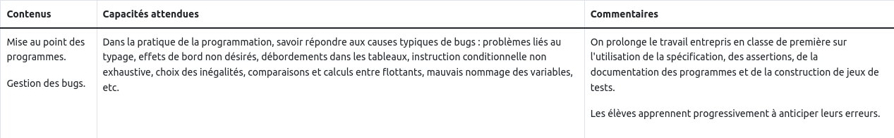
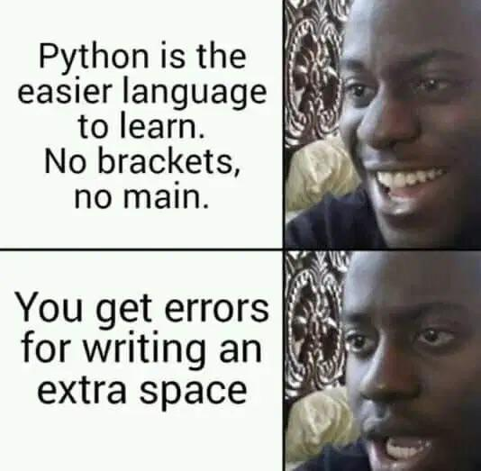

# CH1 : Mise au point des programmes - Gestion des bugs

??? note "Programme officiel"
    {: .center}
"La mise au point du programme doit permettre au programme de répondre à une spécification, durant cette phase, le programmeur se doit de savoir répondre aux causes typiques de bugs."

## 1. Conventions syntaxiques
La programmation est un art délicat : un simple caractère en trop peut provoquer une erreur pour le code tout entier (penser à un innocent caractère d'espace en début de ligne dans un code Python).

{: .center width=40%}

Mais même lorsqu'un code s'exécute sans erreur, il ne faut pas négliger l'aspect purement «esthétique» de celui-ci : il est nécessaire de respecter autant que possible des conventions typographiques, qui vont standardiser le code et le rendre ainsi plus lisible.

Ainsi pour chaque langage, il existe une «bible» de bonnes pratiques de présentation du code, qui visent à l'uniformiser. Pour Python, cette référence s'appelle la Python Enhancement Proposal 8, plus connue sous le nom de PEP8. 

En voici quelques extraits :

### 1.1 Les espaces


▶ Il faut mettre une espace (oui, en typographie, on dit «une» espace et non pas «un» espace) avant et après chaque opérateur de comparaison, d'affectation, ou mathématique  (```=, ==, >, +, *, ...``` )

```python
# PAS BIEN 
a=3

# BIEN 
a = 3
```

```python
# PAS BIEN
if x>3:
    print("ok")

# BIEN
if x > 3:
    print("ok")
```

▶ Pour les opérateurs mathématiques, on essaie de reconstituer les groupes de priorité (lorsqu'il y en a) :

```python
# PAS BIEN
x = 3*2

# BIEN
x = 3 * 2
```

mais 

```python
# PAS BIEN
x = 3 * 2 + 5

# BIEN
x = 3*2 + 5
```

▶ On ne met pas d'espace à intérieur des parenthèses, des crochets ou des accolades :

```python
# PAS BIEN
for x in range( 5 ):
    print( 'bonjour' )

# BIEN
for x in range(5):
    print('bonjour')
```

▶ Pour les virgules, et les deux points : 
pas d'espace avant mais une espace après.

```python
# PAS BIEN
if color == (0,255,0) :
    print('vert')

# BIEN
if color == (0, 255, 0):
    print('vert')
```

On peut contrôler si son code vérifie les standards de la PEP8 sur ce site [http://pep8online.com/](http://pep8online.com/)

### 1.2 Les conventions de nommage

▶ Les variables à une lettre (comme ```i```, ```j```, ```k``` ) sont réservées aux indices (notamment dans les boucles).

▶ Les autres variables doivent avoir des noms explicites, éventuellement écrits en ```snake_case``` si plusieurs mots doivent être reliés.

```python
# PAS BIEN
if d == 1:
    cep += vm

# BIEN
if date == 1:
    compte_epargne += versement_mensuel
```


Rappel des différents types de casse :

- ```snake_case``` : les mots sont séparés par des underscores. Conseillé en Python.
- ```camelCase``` : les mots sont séparés par des majuscules mais la 1ère lettre est minuscule. Conseillé en Javascript.
- ```PascalCase``` : les mots sont séparés par des majuscules et la 1ère lettre est majuscule. Conseillé en C.
- ```kebab-case``` : les mots sont séparés par des tirets courts. Conseillé en HTML - CSS.

▶ Cas particulier des classes en Programmation Orientée Objet : leur nom doit commencer par une majuscule. (cf : cours de Mme Desmarest)

```python
# PAS BIEN
class voiture:
    def __init__(self, annee, marque, modele):
       #pass

# BIEN
class Voiture:
    def __init__(self, annee, marque, modele):
       #pass
```

## 2. Les erreurs courantes en Python - Savoir lire ses erreurs et corriger son code
{: .center}

Lorsqu'on exécute un programme, il peut fonctionner comme prévu, mais il peut également "planter", ou bien ne plus s'arrêter (boucler indéfiniment).

Les sources possibles d'erreurs dans un programme sont nombreuses. En fonction des erreurs rencontrées, Python affiche des erreurs spécifiques qui vous aident à comprendre quel est le problème dans votre programme.

### 2.1 Analyser le traceback

Le traceback est l’ensemble des lignes affichées par l’interpréteur Python lorsqu’une exception est levée. Comprendre le traceback est très utile pour trouver rapidement une faute et l’expliquer. Voici un exemple de traceback affiché lors de l’exécution d’un code:

```python linenums="1"
def moyenne(t):
    n = len(t)
    s = 0
    for i in range(n):
        s = s + t[i]
    return s / n

print(moyenne([]))
```
```python
>>> %Run moyenne.py
    Traceback (most recent call last):
    File "/home/jannel/Bureau/essai_python_mkdocs.py", line 8, in <module>
        print(moyenne([]))
    File "/home/jannel/Bureau/essai_python_mkdocs.py", line 6, in moyenne
        return s / n
    ZeroDivisionError: division by zero
```
Ce traceback est constitué d’une liste de lignes en défaut (il y en a 2 ici), puis d’un message qui précise letype d’exception (c’est la dernière ligne).

En lisant le traceback de haut en bas, on avance dans le temps. Ce qui s’est produit en dernier est donc à la fin du traceback.

En le lisant de haut en bas, on note (notez la correspondance entre ce qui est indiqué ci-dessous et le contenudu traceback) :

- exécution de la ligne 8 «`print(moyenne([]))`». On entre dans la fonction `moyenne` qui a provoqué
- l’exécution de la ligne 6 «`return s / n`», qui a donc provoqué
- la levée d’exceptionZeroDivisionError: division by zero

La plupart du temps, la lecture des trois dernières lignes du traceback permet de cerner le problème : Ici, on effectue une divison par 0. Cela s'est produit lors du renvoie du calcul de s par n. Calcul qui est fait à la ligne 6.

Cette erreur n'est levée uniquement parceque on a fait appel à la fonction moyenne sur un tableau vide. La fonction par elle même est correcte. Il faut juste faire attention et préciser à l'utilisateur que la fonction doit être appelée avec des tableaux non vides.

Pour éviter ces erreurs, il est donc important de :
- savoir lire le traceback.
- prévoir des jeux de tests.
- spécifier la fonction pour pouvoir bénéficier d'une aide à l'utilisation de celle-ci.

### 2.2 Quelques erreurs courantes
Voici quelques erreurs courantes que vous devez apprendre à reconnaitre parmi les nombreuses exceptions de Python.

| Type d'erreur | Objet Python | Erreurs courantes | Exemple |
| ------------- | ------------ | ----------------- | ------- |
| Erreurs de syntaxe | `SyntaxError` | Erreur de parenthèse, : manquant avant un bloc d'instruction ... | `len(t))` |
| Erreurs d'indexation | `IndexError` | Accès à un index non présent dans une liste, ou un tuple, str...  | `t = [2, 3]` puis `print(t[2])` |
| Erreurs de nom | `NameError` | Nom de fonction ou de variable mal orthographié. | `print(Bonjour)` ou `prin("Bonjour")` |
| Erreurs d'indentation  | `IndentationError` | Indentation oubliée, ou trop grande, les blocs sont alors mal délimités. |  |
| Erreurs de type  | `TypeError` | Opération impossible entre deux types(str - int). Conversion de type impossible. | `'3' * '5'` |


** Exercices :**

Identifier le type d'erreur dans les exerices ci-dessous et corriger les.

??? question "Question 1"
    === " code "
        On désire afficher les éléments de la liste.
        ```python linenums="1"
        lst = [1, 2, 3]
        i = 0
        while i < 4:
            print(lst[i])
            i = i + 1
        ```
    === " solution "
        `IndexError` : la liste ne contient que 3 éléments
        ```python linenums="1"
        lst = [1, 2, 3]
        i = 0
        while i < 3:
            print(lst[i])
            i = i + 1
        ```
        On rapelle qu'il est préférable de parcourir une liste (tableau) en utilisant une boucle for.

??? question "Exercice 2"
    === "code"
        ```python linenums="1"
        a = 2
        b = "Une fois sur "
        print(b + a)
        ```
    === "solution"
        `TypeError` : On ne peut pas concaténer une chaine de caractères avec un int.
        ```python linenums="1"
        a = "2"
        b = "Une fois sur "
        print(b + a)
        ```
        ou alors
        ```python linenums="1"
        a = 2
        b = "Une fois sur "
        print(b + str(a))
        ```

??? question "Exercice 3"
    === "code"
        Afficher la somme de tous les éléments de la liste.
        ```python linenums="1"
        l = [0, 4, 8, 5]
        for v in l:
            s = s + v
        print(s)
        ```
    === "solution"
        `NameError` : la variable s n'est pas initialisée avant la boucle. L'expression `s + v` ne peut être calculée.       `
        ```python linenums="1"
        l = [0, 4, 8, 5]
        s = 0 # par exemple
        for v in l:
            s = s + v
        print(s)
        ```

??? question "Exercice 4"
    === "code"
        Afficher les éléments de la liste
        ```python linenums="1"
        t = [4, 8, 9, 2, 5]
        for elt in t:
        print(elt)
        ```
    === "solution"
        `IndentationError` : il manque l'indentation avant le print.        `
        ```python linenums="1"
        t = [4, 8, 9, 2, 5]
        for elt in t:
            print(elt)
        ```

??? question "Exercice 5"
    === "code"
        Afficher la plus petite valeur contenue dans la liste
        ```python linenums="1"
        liste = [8, 9, 5, 1, 6]
        mini = liste[0]
        for i in range(len(liste)):
            if liste[i] < mini
                mini = liste[i]
        print(mini)
        ```
    === "solution"
        `SyntaxError` : il manque `:` dans la condition (ligne 4)
        ```python linenums="1"
        liste = [8, 9, 5, 1, 6]
        mini = liste[0]
        for i in range(len(liste)):
            if liste[i] < mini:
                mini = liste[i]
        print(mini)
        ```
!!! info "Remarques"
Attention, si l'interpréteur Python ne renvoie pas d'erreur, cela ne signifie pas pour autant que votre code est correct. Dans l'exemple de la fonction moyenne qui doit renvoyer la moyenne des valeurs contenues dans un tableau, la fonction fait correctement le travail mais elle ne fonctionne pas sur une liste vide, ou sur une liste qui ne contiendrait pas uniquement des valeurs numériques.
D'autres erreurs peuvent être non affichées dans l'interpréteur. Par exemple :

- des instructions conditionnelles qui oublient des cas, des mauvaises conditions ...
- des boucles qui ne se terminent pas : cas de la boucle while
- des effets de bords : on modifie une variable globale à l'intérieur d'une fonction.

Il est donc important avant de coder de spécifier une fonction, de docummenter si nécessaire une partie du code, de prévoir des jeux de tests. Tester, debugger, font partie des bonnes pratiques du programmeur. Ça s'appelle mettre au point du code.


## 3. Documenter et spécifier

### 3.1 Commenter son code ? (ou pas)

Il est d'usage de dire qu'un code doit être assez **explicite** pour que le lecteur puisse le comprendre sans avoir à lire un commentaire. 

De fait, les commentaires sont parfois (souvent) superflus :

{: .center width=40%}


Et s'ils sont réellement nécessaires, il faut se poser la question : est-ce que ce code n'aurait pas pu être plus simple ? (attention, la réponse n'est pas toujours oui)

**Exemple :**

Considérons la fonction suivante.
```python
def f(c, t, n):
    # c est le capital de départ, t le taux annuel et n le nombre d'années
    return c * (1 + t)**n  #renvoie le capital après n années
```
Elle est bien commentée. Mais si on croise la fonction ```f()``` ailleurs dans le code, se souviendra-t-on de son rôle ?

Il aurait mieux valu écrire :
```python
def capital_apres_n_annees(capital, taux, nombre_annees) :
    return capital * (1 + taux)**nombre_annees
```
Ce code est plus long, mais assez explicite pour se passer de commentaires.

### 3.2 Le cas particulier des ```docstrings```

#### 3.2.1 Que sont les ```docstrings```?

Les ```docstrings``` sont des commentaires *normalisés* pour les fonctions, qui peuvent être consultés en console.

**Exemples :**

Nous connaissons la fonction ```len()``` qui permet par exemple de connaître la longueur d'une liste passée en paramètre.

Si nous tapons en console la commande ```print(len.__doc__)```, nous aurons la description de cette fonction. 

```python
>>> len.__doc__
'Return the number of items in a container.'
```
Il est aussi possible d'accéder à la docstring d'une fonction ```f```  par la commande ```help(f)``` :

```python
>>> help(len)
Help on built-in function len in module builtins:

len(obj, /)
    Return the number of items in a container.


```

{: .center}


De même pour la fonction ```range``` :
```python
>>> print(range.__doc__)
range(stop) -> range object
range(start, stop[, step]) -> range object

Return an object that produces a sequence of integers from start (inclusive)
to stop (exclusive) by step.  range(i, j) produces i, i+1, i+2, ..., j-1.
start defaults to 0, and stop is omitted!  range(4) produces 0, 1, 2, 3.
These are exactly the valid indices for a list of 4 elements.
When step is given, it specifies the increment (or decrement).
```

Le résultat de la commande ```help(range)``` est trop long pour être repris ici, mais on y retrouve bien la docstring de la fonction ```range```.


#### 3.2.2 Créer ses propres docstrings

Il suffit pour cela de commencer la fonction à documenter par une ou plusieurs phrases entre triples quotes :

```python
def capital_apres_n_annees(capital, taux, nombre_annees) :
    """
    Renvoie le capital après n années.
    input :
        capital : valeur initiale (float)
        taux : taux d'intérêt (float) (ex: 0.02 pour un taux de 2 %)
        nombre_annees : nombre d'années de placement du capital (int)
    output :
        capital après n années (float)
    """
    return capital * (1 + taux)**nombre_annees
```
Ainsi, un utilisateur pourra trouver en console le mode d'emploi de notre fonction :

```python
>>> help(capital_apres_n_annees)
Help on function capital_apres_n_annees in module __main__:

capital_apres_n_annees(capital, taux, nombre_annees)
    Renvoie le capital après n années.
    capital : valeur initiale
    taux : taux d'intérêt exprimé en nombre décimal (ex: 0.02 pour un taux de 2 %)
    nombre_annees : nombre d'années de placement du capital
```

Comme on le voit, tout cela est très «verbeux». Cela peut nous paraître largement superflu puisque nos codes dépassent rarement quelques dizaines de lignes et sont lus par rarement plus de 2 personnes. Mais dans la vraie vie des développeurs, il est primordial qu'un code soit clair et documenté.

!!! note "À retenir"

    - des commentaires quand cela est necéssaire
    - des noms de variable explicites
    - une spécification des fonctions avec une docstring sous le modèle suivant :
        ```python
            def ma_fonction():
                """
                que renvoie ma_fonction
                input :
                    arguments, type
                output :
                    valeur de sortie, type
                """
                votre code
        ```
        

## 4. La programmation défensive : des ```assert``` pour sécuriser le code 

La programmation défensive est l'art de prévoir le pire et d'essayer de le détecter avant qu'il ne soit trop tard.  
De manière bien plus concrète, il est d'usage d'essayer de répérer si des données (souvent des paramètres d'une fonction) sont susceptibles de créer des problèmes, ou sont hors spécification.

**Un exemple :**

La fonction :

```python
def racine_carree(x):
    assert x >= 0, 'un nombre positif ou nul est requis'
    return x ** 0.5
```
donnera, lors de l'appel à ```racine_carree(-2)```, le message suivant :

```python
>>> racine_carree(-2)
Traceback (most recent call last):
  File "<pyshell>", line 1, in <module>
  File "/home/gilles/Bureau/exemples_assert.py", line 2, in racine_carree
    assert x >= 0, 'un nombre positif ou nul est requis'
AssertionError: un nombre positif ou nul est requis
```

**Un autre exemple :**

```python
def moyenne_trimestrielle(liste_notes):
    """
    calcule la moyenne des nombres de la liste liste_notes
    """
    assert liste_notes != [] , 'liste vide'
    assert max(liste_notes) <= 20, 'au moins une note dépasse 20'
    assert min(liste_notes) >=0, 'au moins une note est en dessous de 0'
    
    return sum(liste_notes) / len(liste_notes)
```

À ce stade, les ```assert``` sont donc pour nous juste un moyen rapide de remplacer un test ```if ... then ... else``` pour détecter des erreurs potentielles.  
Ils sont en réalité plus utiles que cela : lors de la conception d'un programme, des ```assert``` sont posés pour vérifier l'intégrité du code, mais peuvent être désactivés à tout moment pour en faire un code optimisé (par la commande ```-O``` à l'exécution). Tout ceci dépasse largement le cadre de notre cours.

Il est à noter aussi que les erreurs peuvent être gérées par le mécanisme ```try ... except```, qui permet de «lever des exceptions». Pour les curieux, plus de renseignements [ici](http://perso.univ-lemans.fr/~berger/CoursPython/co/try_except.html).

## 5. Les tests
### 5.1 Pourquoi des tests ?

Tester une fonction est la première chose que l'on fait (normalement...) lorsqu'on vient de finir de l'écrire. 

Par exemple, si on vient de construire la fonction ```valeur_absolue(n)```, il est fort probable qu'on aille taper ceci dans la console :

```python
>>> valeur_absolue(-3)
3
>>> valeur_absolue(0)
0
>>> valeur_absolue(7)
7
```

- On peut regrouper tous ces tests au sein d'une même fonction ```test_valeur_absolue()```.
- On peut écrire cette fonction ```test_valeur_absolue()``` avant même de commencer à écrire la fonction ```valeur_absolue(n)```.

> Remarque : 
> la méthode de développement logiciel TDD (Test Driven Developement) est basée en partie sur ce principe  : 

> 1. On commence par écrire le test de la fonction.
> 2. Le test échoue (forcément, la fonction n'est pas encore codée !)
 > 3. On écrit le code de la fonction pour que le test soit validé.
 > 4. On améliore (si possible) ce code tout en vérifiant que le test continue à être valide.


{: .center width=40%}


Revenons à nos tests sur la fonction ```valeur_absolue(n)```

```python
def test_valeur_absolue():
    if valeur_absolue(-3) == 3 :
        print("ok")
    else:
        print("erreur")
        
    if valeur_absolue(0) == 0 :
        print("ok")
    else:
        print("erreur")
        
    if valeur_absolue(7) == 7 :
        print("ok")
    else:
        print("erreur")
```

En console, il suffit maintenant d'appeler la fonction ```test_valeur_absolue()``` :

```python
>>> test_valeur_absolue()
ok
ok
ok
```


### 5.2 Revoilà les ```assert```

Utiliser des ```assert``` permet d'écrire très simplement les tests précédents.

Reprenons notre fonction ```valeur_absolue()```. Sa fonction test  ```test_valeur_absolue()``` peut s'écrire :

```python
def test_valeur_absolue():
    assert valeur_absolue(-3) == 3
    assert valeur_absolue(0) == 0
    assert valeur_absolue(7) == 7

```

??? question "**Exercice :**"
    === "énoncé"
        Écrire une fonction ```maxi(liste)``` qui renvoie le plus grand élément de la liste d'entiers  ```liste```, supposée non vide, passée en paramètre (de préférence sans utiliser la fonction ```max()```).  
        Vous écrirez **d'abord** une fonction ```test_maxi()``` avant d'écrire la fonction ```maxi(liste)```.
    === "solution"
        ```python
        def test_maxi():
            assert maxi([5]) == 5
            assert maxi([-1, 5, 4, 0]) == 5
            assert maxi([8, 7, 6, 2]) == 8
            assert maxi([-1, -5, 0]) == 0

        def maxi(liste):
            """
            revoie le maximum d'une liste d'entier non vide
            input : liste (list) d'entiers
            output : maximum (int)
            """
            maximum = liste[0]
            for elt in liste:
                if elt > maximum:
                    maximum = elt
            return maximum
        ```


### 5.3 Le module ```doctest```

Le module ```doctest```  permet d'écrire les tests **à l'intérieur** de la docstring d'une fonction. 

Considérons une fonction dont le but est de compter les voyelles du mot passé en paramètre.

```python
def compte_voyelles(mot):
    """
    renvoie le nombre de voyelles du mot donné en paramètre.
    >>> compte_voyelles("python")
    2
    >>> compte_voyelles("HTTP")
    0
    >>> compte_voyelles("eau")
    3
    """
    voyelles = "aeiou"
    total = 0
    for lettre in mot:
        if lettre in voyelles:
            total += 1
    return total
```

Observez bien la docstring : elle contient explicitement ce qu'on veut que renvoie le terminal lorsqu'on appellera la fonction.
On écrit donc les trois chevrons ```>>>``` suivi de l'appel à la fonction, et à la ligne en dessous ce que nous espérons que la fonction nous renvoie.
On peut écrire autant de tests que l'on veut.

Ensuite, en console :
```python
>>> import doctest
>>> doctest.testmod()
```
Dans notre cas, le retour sera celui-ci :

```python
>>> import doctest
>>> doctest.testmod()
**********************************************************************
File "voyelles.py", line 4, in __main__.compte_voyelles
Failed example:
    compte_voyelles("python")
Expected:
    2
Got:
    1
**********************************************************************
1 items had failures:
   1 of   3 in __main__.compte_voyelles
***Test Failed*** 1 failures.
TestResults(failed=1, attempted=3)
```

On voit que le test ```compte_voyelles("python")``` a renvoyé la valeur 1 alors qu'on attendait 2. En regardant notre fonction, on s'aperçoit donc qu'on avait oublié le ```y``` dans la liste des voyelles. 

En corrigeant ceci, le test devient :
```python
>>> import doctest
>>> doctest.testmod()
TestResults(failed=0, attempted=3)
```
Ce qui est beaucoup plus satisfaisant.

On peut, au lieu d'utiliser doctest dans la console Python, placer à la fin du fichier le code suivant :
```python
if __name__ == '__main__':
    import doctest
    doctest.testmod()
```
Le resultat des tests, si ils ne passent pas, se fera dans l'interpréteur à chaque execution du code.

### 5.3 À propos des tests
Le comportement face aux tests en programmation doit être le même qu'en mathématiques : _un test qui ne marche pas est plus riche d'enseignements qu'un test qui marche_.

En mathématiques, seule la notion de contre-exemple est fertile : si quelqu'un vous affirme que _«tous les nombres impairs sont premiers»_, il vous suffit d'exhiber le nombre 9 pour lui prouver qu'il a tort et achever la discussion.

Par contre, il aurait pu essayer de vous convaincre avec les nombres 3, 5 et 13, qui sont bien impairs et premiers.

De la même manière, voir qu'une fonction passe les tests que vous avez écrits ne vous assurera pas que cette fonction aura _toujours_ le bon comportement souhaité. Elle l'aura pour les valeurs de test, mais pas forcément pour les autres.

En revanche, si une fonction ne passe pas un des tests, vous avez la certitude qu'il y a un problème à régler quelque part.

Tout ceci en admettant, bien sûr, que vos tests _eux-mêmes_ ne comportent pas d'erreurs...