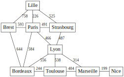
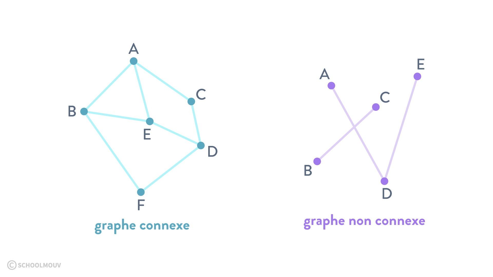
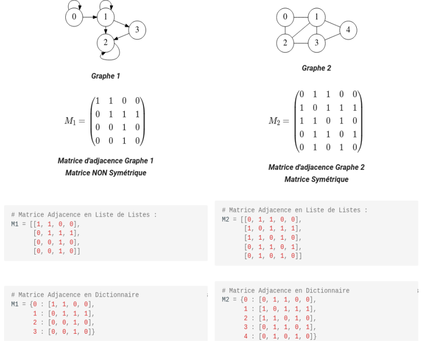

# CH7 : Les graphes

??? note "Programme officiel"
    {: .center}
    {: .center}

# 1. Qu'est ce qu'un graphe ?
## 1.1 Des exemples de graphes
Le graphe est une structure de données très utilisée pour représenter les liens et les interactions entre des objets, les personnes, les villes, les ordinateurs ... En effet, nous verrons qu'il existe de nombreuses variétés de graphes permettant ainsi de décrire des situations diverses, tout en conservant, une même représentation et donc des mêmes méthodes pour les manipuler par informatique.


Exemple 1 : **Le réseau social**



Exemple 2 : **Le réseau routier**


Exemple 3 : **Réseau informatique**

## 1.2 Définition
!!! note "Définition"
	Un graphe **G** est une structure de données non linéaire composée d'objets:

	- les **sommets**, notés **V**  comme vertex :gb: ou vertice :gb:, dans laquelle certaines paires d'objets sont reliées.
	- des **arêtes**, notées **E** comme edge :gb:, reliant les sommets.

Exemple :

V = {A; B; C} et E = {(A, B); (A, C); C}

G = (V , E) est un graphe de sommets A, B et C où A et B sont reliés, A et C sont reliés, et C est connecté à lui-même.

## 1.3 Représentation sagitale d'un graphe
La représentation sagittale d’un graphe G = (V , E) est un schéma où les éléments de V (sommets) sont représentés par des disques et où les éléments de E (arêtes) sont représentés par des traits.

Exemple :

Représentation du graphe G = {V = {A; B; C} ; E = {(A, B); (A, C); C}}

{.width=30%}

??? "Remarque"
	Aucune règle dicte la façon dont il faut disposer les arêtes relient les sommets. Les deux représentations du graphe ci-dessous sont identiques.

	

# 2. Vocabulaire sur les graphes
## 2.1 Graphes non-orientés, orientés, pondérés
### Graphes non orientés et orientés
!!! savoir "À savoir"
	On distingue les graphes non orientés, où les arêtes relient deux sommets de manière symétrique et les graphes orientés, où les arêtes, alors appelés arcs, relient deux sommets de manière asymétrique.


### Graphes pondérés
!!! savoir "À savoir"
	On dit qu’un graphe est pondéré quand ses arêtes ou ses arcs sont couplés avec des nombres. Ces nombres sont appelés des poids.

Exemple : Parcours d’un livreur : les arêtes représentent le temps qu’il met pour aller d’un sommet à l’autre.


## 2.2 Complexité et morphologie
Voici du vocabulaire pour qu'on puisse tous parler de la même chose.

### ordre
!!! savoir "À savoir"
	L'**ordre** d'un graphe correspond au nombre de ses sommets.


### taille
!!! savoir "À savoir"
	La **taille** est le nombre de ses arêtes ou arcs.


### degré
!!! savoir "À savoir"
	Le **degré** d'un sommet est le nombre d'arêtes qui relient ce sommet à d'autres sommets.

??? "Remarque"
	Pour un graphe orienté, le **degré entrant** d'un sommet est le nombre d'arcs entrants et le **degré sortant** est le nombre d'arcs sortants.

### densité
!!! savoir "À connaître"
	La **densité D** d'un graphe est une indication de sa connectivité et indique s'il y a beaucoup ou peu d'arêtes.

	- $D = \dfrac{E}{V \times (V-1)}$ pour un graphe non orienté.
	- $D = \dfrac{2 \times E}{V \times (V-1)}$ pour un graphe orienté.

??? "Remarque"
	D = 1 pour un graphe complet et 0 pour un graphe sans aucune arête. Plus D se rapproche de 1 et plus le graphe est dense. Et plus D se rapproche de 0, plus le graphe est creux.

### sommets adjacents
!!! savoir "À savoir"
	Deux sommets reliés par une arête sont dits adjacents.

??? "Remarques"
	- Dans un graphe non orienté, lorsque deux sommets sont adjacents, on dit qu'ils sont **voisins**.
	- Dans un graphe orienté, on parle de **successeurs** (sommet d'arrivée) et de **prédécesseurs** (sommet de départ).

### chaîne ou chemin
!!! savoir "À savoir"
	Une **chaîne** est une séquence d'arêtes consécutives dans un graphe non-orienté. Dans un graphe orienté on parle de **chemin**.


### simple
!!! savoir "À connaitre"
	Un graphe est dit **simple** si il ne peut y avoir au plus qu'une arête entre deux sommets (ou au plus un arc dans le même sens pour un graphe orienté). Par exemple un compte *Twitter* est un graphe orienté ou un compte ne peut pas suivre plusieyr fois le même compte.

??? "Remarque"
	Dans le cas contraire on parle de **multi-graphe**. On peut imaginer un graphe routier dans lequel deux villes peuvent être reliées par deux trajets différents (poids différents car distances à parcourir différentes) ou moyens de transport différents (voiture, train ...).


### cyclique
!!! savoir "À connaitre"
	Un graphe est dit **cyclique** s’il existe une chaîne ou un chemin reliant n’importe quel sommet à lui-même.

Exemple :


Une chaine par exemple : 1 - 4 - 5 - 2 - 1. On a bien existence d'un cycle.

### connexe
!!! savoir "À connaitre"
	Un graphe est dit **connexe** si ses sommets peuvent être reliés deux à deux par une arête ou un arc.

Exemple :




### complet
!!! savoir "À connaitre"
	Un graphe est dit **complet** si deux sommets quelconques sont adjacents (reliés par une arête).

Exemple :


# 3. Les graphes en programmation
## 3.1 Liste d'adjacence
!!! savoir "À savoir"
	La **liste d'adjacence** d'un graphe, est la liste des voisins (sommets adjacents de destination) de chaque sommet.

Exemple :


Liste d'adjacence du graphe : (1 -> (1; 4); 2 -> (1; 3; 4); 3 -> (4); 4 -> (3))

??? "Remarques"

	- Lorsque le graphe est non orienté, la liste d'adjacence est une liste de voisins
	- Lorsque le graphe est orienté, la liste d'adjacence peut être représentée par :
		- la liste de ses successeurs, ou bien
    	- la liste de ses prédécesseurs, lorsque les problèmes étudiés s'y prêtent mieux (ça arrive)


### implémentation en Python
On utilisera le graphe précédent pour illustrer le cours.


#### implémentation en utilisant un objet de type `dict`
On peut utiliser un **dictionnaire** dans lequel les **clés** sont les sommets et les **valeurs** les sommets de destinations.
```python
G = {'1': ['1', '4'], '2': ['1', '3', '4'], '3': ['4'], '4': ['3']}
```

??? "Remarque"
	On pourrat utiliser une liste de listes comme ci-dessous :

	```python
	G = [[1, 4], [1, 3, 4], [4], [3]]
	```

	Cela pose deux problèmes :

		- l'ordre des sommets.
		- la complexité d'une recherche en O(n) (O(1) avec un dictionnaire).

## 3.2 Matrice d'adjacence
!!! note "Qu'est qu'une matrice ?"
		Une matrice est un tableau de nombres. elle peut être représentée en Python facilement :

		- par une liste de listes en Python (par défaut)
    	- un dictionnaire, en notant A une certaine matrice, Alors A[i][j] désigne l'élément situé à la ligne i et à la colonne j

    	Remarque :

    	Une matrice est dite symétrique si pour tout i et j : A[i][j] = A[j][i]. Cela revient à ce que les coefficients A[i][j] soient symétriques par rapport à la diagonale principale.

!!! savoir "À savoir"
	Un graphe (orienté, ou pas) peut être représenté par une matrice d'adjacence :

    	- tout lien depuis le sommet i vers le sommet j, est représenté par A[i][j] = 1
    	- Une absence de lien du sommet i vers le sommet j, est représenté par A[i][j] = 0

Exemples :



!!! savoir "À savoir"
	Un graphe pondéré (orienté, ou pas) peut être représenté par une matrice d'adjacence :

    	- tout lien depuis le sommet i vers le sommet j, est représenté par A[i][j] = p où p désigne le poids du lien du sommet i vers le sommet j.
		- Une absence de lien du sommet i vers le sommet j, est représenté par A[i][j] = 0

Exemples :


## 3.3 Choisir une représentation
Les représentations en liste d'adjacence et en matrice d'adjacence sont équivalentes du point de vue des informations qu'elles contiennent, mais présentent des avantages et des inconvénients pour l'accès à ce informations.

Une liste d'adjacence permet par exemple de lister immédiatement tous les voisins d'un sommet alors qu'avec une matrice on est obligé de parcourir toute la ligne correspondante. Dans des très grands graphes avec peu de connectivité cela peut représenter une perte de temps. Dans ces mêmes graphes, une matrice stockera beaucoup de 0. Et donc utilisera beaucoup d'espace mémoire pour les cases vides de la matrice.

À l'inverse, une matrice permet de savoir immédiatement l'existence d'un arc entre deux sommets. Avec une liste, il est nécessaire de parcourir la liste entière.

Le choix de la représentation dépend donc de la taille du graphe, de sa connectivité et des opérations que l'on va devoir effectuer le plus souvent.

## 3.4 Travaux dirigés
Feuille de travail sur table [ici](data/TD_graphe1.pdf).

## 3.5 Travaux pratiques

# 4. Parcours de graphes
## 4.1 Parcours en largeur BFS
## 4.2 Parcours en profondeur DFS